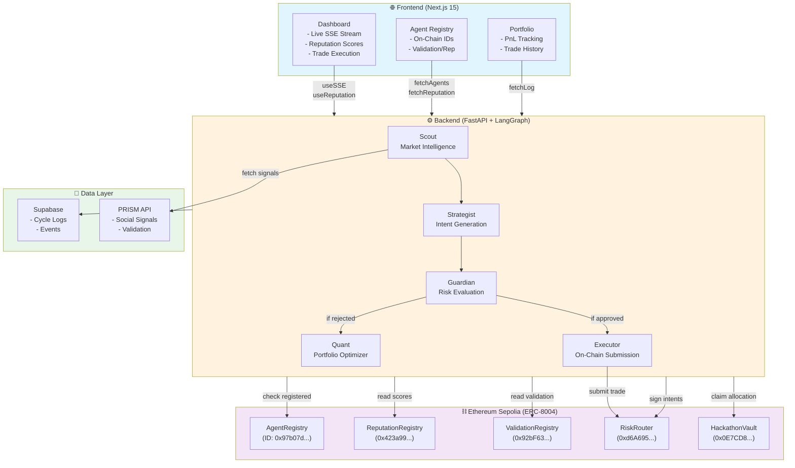
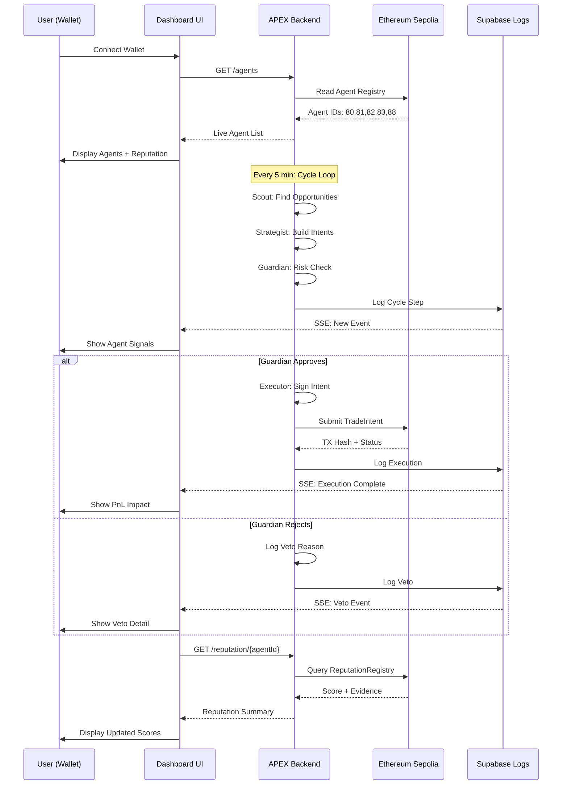

<p align="center">
  
</p>

<h1 align="center">🚀 APEX</h1>
<p align="center"><strong>Autonomous Multi-Agent Yield Optimizer with On-Chain Reputation</strong></p>

<p align="center">
  
  
  
  
  
  
</p>

---

## 🎯 What APEX Does

APEX runs an autonomous **4-agent + optimizer pipeline** for DeFi yield discovery and intelligent risk-gated execution:

- **🔍 Scout** scans market opportunities across Aerodrome, Aave, Curve, Compound
- **📊 Strategist** ranks opportunities and generates signed EIP-712 trade intents  
- **🛡️ Guardian** evaluates risk and approves/vetoes trades with confidence scores
- **⚡ Executor** submits approved intents on-chain via RiskRouter
- **🧮 Quant** (bonus agent) optimizes portfolio allocation and rebalancing

Every cycle streams live over **SSE** for real-time dashboard updates, with persistent logs in **Supabase**.

---

## 🏗️ System Architecture



---

## 👥 Agent Workflow & User Journey



---

## 🛠️ Tech Stack

| Layer | Technology | Purpose |
|-------|-----------|---------|
| **Frontend** | Next.js 15, React 19, TypeScript | Real-time dashboard & wallet integration |
| **RPC/Wallet** | wagmi, RainbowKit, Viem | Wallet connection & contract interaction |
| **Backend** | FastAPI, LangGraph, Python 3.12+ | Agent orchestration & business logic |
| **Blockchain** | Ethereum Sepolia (ERC-8004) | On-chain reputation, validation, registry |
| **Data** | Supabase (PostgreSQL) | Cycle logs, event history |
| **Market Data** | PRISM API, Aerodrome, Aave, Curve, Compound | Opportunity discovery & market context |
| **Signing** | eth-account, EIP-712 | Intent generation & authentication |

---

## 🎮 Product Surfaces

| Route | Purpose |
|-------|---------|
| **`/`** | 🏠 Marketing landing + live pipeline visualization |
| **`/dashboard`** | 📊 Cycle monitor, live SSE stream, current decision, session metrics |
| **`/dashboard/agents`** | 🤖 Per-agent reputation, validation scores, on-chain links |
| **`/dashboard/portfolio`** | 📈 PnL tracking, trade history, portfolio metrics |
| **`/dashboard/veto-log`** | 🚫 Filterable veto history with reasoning |
| **`/dashboard/settings`** | ⚙️ Runtime config, RPC settings, contract references |
| **`/docs`** | 📚 Protocol documentation & API reference |

---

## 📡 API Endpoints

| Endpoint | Method | Purpose |
|----------|--------|---------|
| `/health` | GET | Runtime status, RPC connectivity, agent IDs loaded |
| `/agents` | GET | Registered agents with live on-chain IDs |
| `/reputation/{agent_id}` | GET | Agent reputation summary + evidence |
| `/stream` | GET | **SSE** - Real-time cycle events (Scout→Strategist→Guardian→Executor) |
| `/log` | GET | Cycle history with optional wallet filter |
| `/market/prices` | GET | Current market prices for major pairs |
| `/market/signals` | GET | Market sentiment & volatility signals |

---

## 🎯 Trading Modes

APEX adapts to available credentials:

| Mode | Credentials | Behavior | Use Case |
|------|-------------|----------|----------|
| **Autonomous** | Full env vars + RPC + Vault | Real on-chain execution | Production |
| **Guarded** | Full config but with risk limits | Agent approves/vetoes cycles | Testing |
| **Simulated** | Partial/fallback config | Mock fills & PnL | Development |
| **Live Events Only** | Dashboard API only | Monitor cycles, no execution | Frontend demo |

> **Note**: No real trades execute unless Guardian approves AND execution credentials are present.

---

## 🚀 Quick Start

### Prerequisites

✅ **Required**
- Python 3.12 or later
- Node.js 18 or later  
- Git

✅ **Optional but Recommended**
- Supabase account (for persistent event logs)
- Pinata account (for IPFS agent metadata)
- Groq API key (free tier for LLM)

### 1️⃣ Clone & Install

```bash
git clone https://github.com/yourusername/Apex.git
cd Apex

# Backend dependencies
pip install -r requirements.txt

# Frontend dependencies
cd frontend
npm install
cd ..
```

### 2️⃣ Environment Configuration

```bash
cp .env.example .env  # Create from template
nano .env              # Edit with your values
```

**Core Variables:**
```env
# LLM Provider
GROQ_API_KEY=your_groq_key
# or
GEMINI_API_KEY=your_gemini_key

# Ethereum Private Key (for on-chain operations)
APEX_PRIVATE_KEY=0x...

# Sepolia RPC Node
SEPOLIA_RPC_URL=https://ethereum-sepolia-rpc.publicnode.com

# On-Chain Contracts (Sepolia)
AGENT_REGISTRY_ADDRESS=0x97b07dDc405B0c28B17559aFFE63BdB3632d0ca3
REPUTATION_REGISTRY_ADDRESS=0x423a9904e39537a9997fbaF0f220d79D7d545763
VALIDATION_REGISTRY_ADDRESS=0x92bF63E5C7Ac6980f237a7164Ab413BE226187F1
RISK_ROUTER_ADDRESS=0xd6A6952545FF6E6E6681c2d15C59f9EB8F40FdBC
HACKATHON_VAULT_ADDRESS=0x0E7CD8ef9743FEcf94f9103033a044caBD45fC90

# Agent IDs (populated after registration)
APEX_SCOUT_AGENT_ID=80
APEX_STRATEGIST_AGENT_ID=81
APEX_GUARDIAN_AGENT_ID=82
APEX_EXECUTOR_AGENT_ID=83

# Optional: Portfolio Optimizer
APEX_QUANT_AGENT_ID=88

# Frontend
NEXT_PUBLIC_API_URL=http://localhost:8000
NEXT_PUBLIC_SEPOLIA_RPC=https://ethereum-sepolia-rpc.publicnode.com
```

### 3️⃣ Register Agents (First Time Only)

```bash
# Dry-run to validate config
python scripts/register_agents.py --dry-run

# Register agents on-chain
python scripts/register_agents.py
```

### 4️⃣ Start Backend & Frontend

**Terminal 1 - Backend:**
```bash
uvicorn api:app --host 0.0.0.0 --port 8000 --reload
```

**Terminal 2 - Frontend:**
```bash
cd frontend
npm run dev
# Opens at http://localhost:3000
```

### 5️⃣  Verify Connection

```bash
# Check backend health
curl http://localhost:8000/health

# Check frontend loads
open http://localhost:3000
```

---

## 🧪 Demo Walkthrough

**Step 1:** Open [http://localhost:3000/dashboard](http://localhost:3000/dashboard)
- Connect your wallet via RainbowKit
- View live agent cards with reputation scores

**Step 2:** Observe Agent Cycles
- Backend runs cycles every 5 minutes (configurable)
- Scout finds opportunities → Strategist builds intents → Guardian approves/rejects
- Each step streams live to dashboard via SSE

**Step 3:** Monitor Trade Execution
- If Guardian approves, Executor submits intent to RiskRouter
- Dashboard shows TX hash, status, and PnL
- Portfolio page accumulates session PnL

**Step 4:** Check Veto Log  
- Navigate to `/dashboard/veto-log`
- Filter by date or confidence score
- See Guardian's reasoning for each rejection

---

## 📂 Project Structure

```
Apex/
├── api.py                      # FastAPI entrypoint
├── agents/                     # LangGraph agent nodes
│   ├── scout.py
│   ├── strategist.py
│   ├── guardian.py
│   ├── executor.py
│   └── graph.py               # DAG orchestration
├── mcp_tools/                 # Service integrations
│   ├── market_data.py         # Aerodrome, Aave, etc.
│   ├── signing.py             # EIP-712 intent signing
│   ├── erc8004_skills.py      # On-chain reputation
│   └── execution.py           # Trade submission
├── contracts/                 # Solidity + ABIs
│   ├── src/
│   ├── script/
│   └── addresses.json
├── frontend/                  # Next.js 15 app
│   ├── src/
│   │   ├── app/              # Pages & routes
│   │   ├── components/       # React components
│   │   ├── hooks/            # Custom hooks (useSSE, useReputation)
│   │   └── lib/              # Utilities, contracts, API
│   └── package.json
├── scripts/                   # Operational utilities
│   ├── register_agents.py     # On-chain registration
│   ├── submit_intents.py      # Trade intent submission
│   └── deploy_contracts.py    # Smart contract deployment
├── tests/                     # pytest suites
├── requirements.txt           # Python dependencies
├── .gitignore                 # Clean repo config
└── README.md                  # This file
```

---

## 🧪 Testing

### Backend Unit Tests

```bash
# Run all tests
pytest -v

# Run specific suite
pytest tests/test_executor.py -v

# Coverage report
pytest --cov=agents --cov=mcp_tools
```

### Frontend Build Check

```bash
cd frontend
npm run build         # Production build
npm run lint          # TypeScript + ESLint
```

---

## 🌐 Deployment

### Local (Development)
Already covered in Quick Start above.

### Docker (Simple)

```bash
# Backend
docker build -f Dockerfile -t apex-backend .
docker run -p 8000:8000 --env-file .env apex-backend

# Frontend  
cd frontend
docker build -f Dockerfile -t apex-frontend .
docker run -p 3000:3000 apex-frontend
```

### Vercel (Frontend Only)

```bash
vercel deploy frontend/
# Set env vars in Vercel dashboard
```

### Render/Railway (Backend)

```bash
# Connect repo to Render/Railway
# Set env vars in dashboard
# Deploy uvicorn:app
```

---

## 📊 Monitoring

### View Live Stream

```bash
# Terminal 3
curl -N http://localhost:8000/stream
# Shows real-time cycle events in SSE format
```

### Check Agent Logs

```bash
curl http://localhost:8000/log?limit=10
# Returns recent cycle history
```

### Track Reputation

```bash
curl http://localhost:8000/reputation/80  # Scout (agentId=80)
# Returns avg score, evidence, signals
```

---

## 🤝 Contributing

1. Fork & clone the repo
2. Create a feature branch: `git checkout -b feature/cool-feature`
3. Make changes and test locally
4. Submit PR with description

**Development Tips:**
- Backend hot-reload: `uvicorn api:app --reload`
- Frontend hot-reload: `npm run dev`
- Use `.env.example` as reference
- Run tests before committing

---

## 📄 License

MIT - See LICENSE file for details

---

## 🙏 Acknowledgments

- **ERC-8004** standard for portable agent identity
- **LangGraph** for reliable agentic orchestration
- **Lablab.ai** for hackathon sponsorship
- **Groq** for LLM inference
- **Aerodrome & DeFi protocols** for liquidity data

---

## 💬 Support

- 📖 Read the [docs](./frontend/src/app/docs/page.tsx)
- 🐛 [Open an issue](https://github.com/yourusername/Apex/issues)
- 💡 Suggest features or improvements

---

<p align="center">
  <strong>Built during Lablab.ai Hackathon 🚀</strong><br/>
  <sub>Autonomous agents meeting on-chain reputation</sub>
</p>
